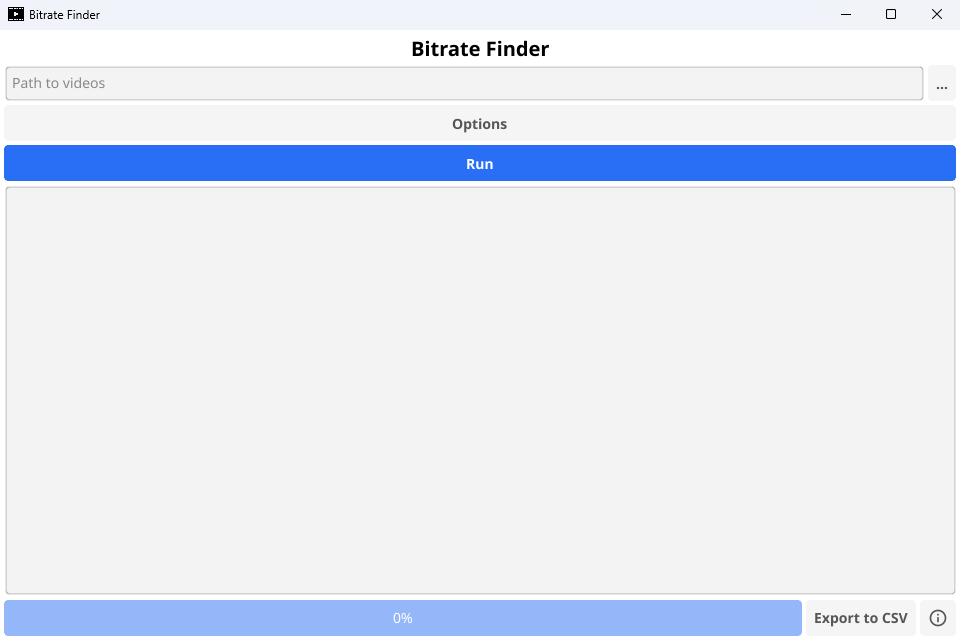

# Bitrate Finder

Bitrate Finder is a program for you media server aficionados out there. By selecting your media library's directory, Bitrate Finder will obtain the average bitrate of each file and output it based on a given filter (e.g. Only displaying media with a bitrate below 8000Kb/s). This is useful for determining which files may need to be re-encoded from their original source to maintain high qualities.

Prebuilt Windows binaries are available from the GitHub page.

**Requires access to the ``ffprobe`` command, which can be downloaded as part of [FFMPEG](https://ffmpeg.org/)**

## Features

- Listing bitrate of all files in a given directory
- Setting optional maximum and minimum bitrate filters
- Ability to exclude files with a bitrate of 0Kb/s (``ffprobe`` returns 0Kb/s for non-video/audio files)
- Progress tracking to view completion percentage
- Ability to export results to a CSV file

## Building

Built using the [Fyne](https://fyne.io/) GUI framework for Go, Bitrate Finder can be compiled to a single binary with the following commands:

```
git clone https://github.com/odddollar/Bitrate-finder.git
cd Bitrate-finder
go install fyne.io/fyne/v2/cmd/fyne@latest // installs the necessary Fyne tooling
fyne package
```

## Screenshots


